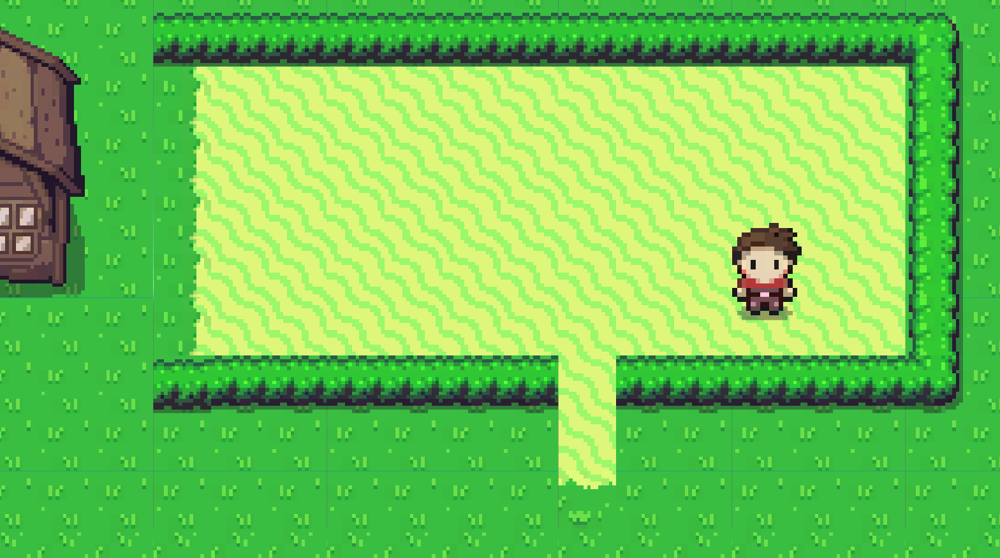
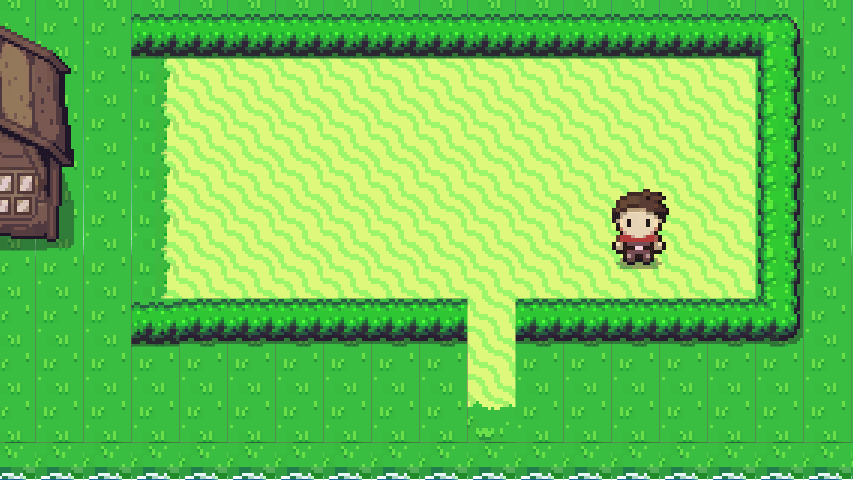

# [Unity](https://unity.com/) Prototype

This is a 2D prototype project.
## Project Description:

Uses touch input and 2D navmesh to create an arpg like touch to move system.

-A quick implementation of the tilemap system. 

## Screenshots

